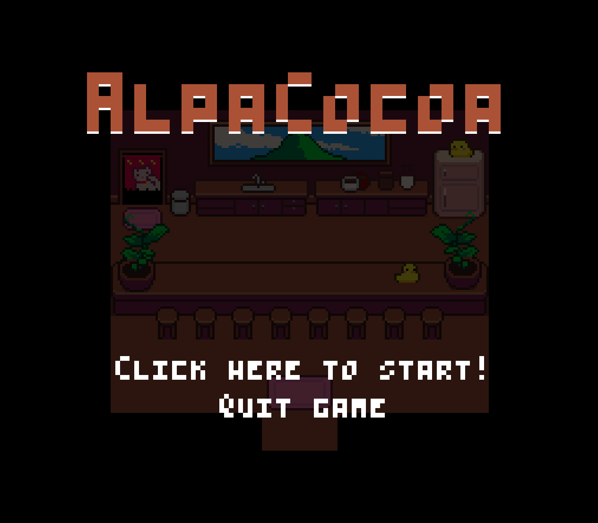
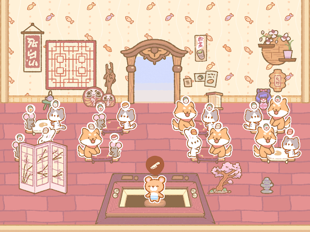
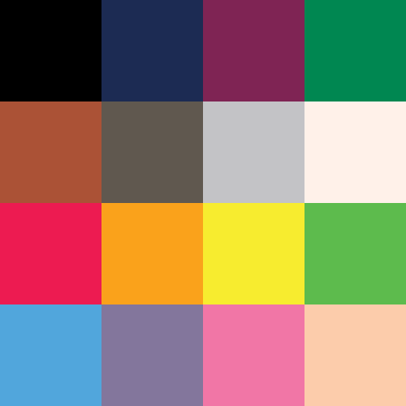
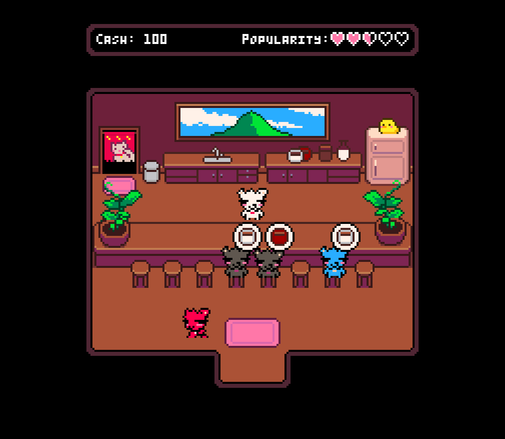

#  AlpaCocoa

# DESIGN DOCUMENT

By whitealpa for CS50 Game Development Course 2024

---

Video : https://www.youtube.com/watch?v=W_k5dkWe4Rk

## Introduction

### Game Summary Pitch

AlpaCocoa is a minimal cocoa barista game about crafting the perfect cup of happiness for happy customers.

### Inspiration

**<u>Kuma Sushi Bar</u>**

Kuma Sushi Bar is a casual restaurant management simulation for a touchscreen device. The main goal is to **select the right combination of ingredients for each customer’s order** using minimal control. The game runs at a comfortable pace and provides a relaxing feeling.

### Player Experience

The player will complete each order with a balance between challenge and skills that helps the player get into a flow state that doesn’t require much thinking process.

### Platform

The game is developed for desktop.	

### Development Software

* Visual Studio Code for IDE
* Love2d for framework (Lua)
* Aseprite and Procreate for graphics and UI
* FamiStudio for theme music
* Audacity for recording and editing SFX

### Genre

Single-player, casual, cozy, management simulation

### Target Audience

With simple and minimal mechanics, this game is aimed towards **casual game players** of all ages who want a relaxing experience 

## Concept

### Gameplay overview

In a single-screen cafe, the player will receive orders from visiting customers. The player must accept the order and choose the right ingredients for each drink in a limited time. **When the player completes the right order, the cafe earns money and popularity points.** The cafe loses money and popularity points if the order is late or wrong.

### Primary Mechanics

1. **Order Reception**: Receive orders from customers.
2. **Ingredient Selection**: Choose the right ingredients for each drink.
3. **Time Management**: Complete orders within a limited time.
4. **Order Completion**: Serve the completed order.
5. **Feedback and Scoring**: Earn money or lose popularity points based on performance.

## Art

### Theme Interpretation

With a casual and minimal game with simple mechanics, **the PICO-8 16-color palette** is used as a reference to represent the simplicity and cheerfulness of the game. 

### Design

The overall design is based on a **retro SNES style** in 256 x 224 resolution (8:7 ratio). The cafe has a top-down design similar to the inns or taverns in JRPG games. 

## Audio

### Music

For simplicity, only one main theme is used in the game. Music is made using simple retro-style tracks.

### Sound Effects

To create an immersive and relaxing experience, realistic and ASMR-like sounds for drink mixing in the game. And use Shure MV7 to record different objects in real life to replicate various sound effects.

## Game Experience

### UI

User Interface is in pixel art in the overall game art for cohesion.

### Controls

**<u>Mouse</u>**

Simple left-click only.

**<u>Keyboard</u>**

'Space' bar to pause the game

## Game States

### Title State

Simple UI for the player to start or quit the game.

#### Main Cafe State

The main loop of the game where customers enter the cafe, and the order bubble icon appears.

#### Drink Mixing State

Stack up from the Main Cafe State to mix and serve the drink as per the customer’s  order

#### Game Over State
The game is over when the cash or popularity reaches 0. Popularity dictates the rate of new customer generation.

#### Paused State

The player can pause the game at any time by pressing the ‘space’ bar.

## Development Tasks

**MINIMUM VIABLE PRODUCT**

<table>
  <tr>
   <td><strong>#</strong>
   </td>
   <td><strong>Assignment</strong>
   </td>
   <td>
   </td>
   <td><strong>Notes</strong>
   </td>
  </tr>
  <tr>
   <td>1
   </td>
   <td>Design Document
   </td>
   <td>
   </td>
   <td>
   </td>
  </tr>
  <tr>
   <td>2
   </td>
   <td>Prototype
   </td>
   <td>
   </td>
   <td>Using placeholders
   </td>
  </tr>
  <tr>
   <td>3
   </td>
   <td>Drink recipe design
   </td>
   <td>
   </td>
   <td>Drinks that customers can order and ingredient lists
   </td>
  </tr>
  <tr>
   <td>4
   </td>
   <td>Drink mixing GUI
   </td>
   <td>
   </td>
   <td>Button UI, screen transition
   </td>
  </tr>
  <tr>
   <td>5
   </td>
   <td>Game logo
   </td>
   <td>
   </td>
   <td>
   </td>
  </tr>
  <tr>
   <td>6
   </td>
   <td>Title screen
   </td>
   <td>
   </td>
   <td>
   </td>
  </tr>
  <tr>
   <td>7
   </td>
   <td>Main cafe GUI
   </td>
   <td>
   </td>
   <td>Cafe design and interactive elements
   </td>
  </tr>
  <tr>
   <td>8
   </td>
   <td>Character sprites
   </td>
   <td>
   </td>
   <td>A player and customers with color variations
   </td>
  </tr>
  <tr>
   <td>9
   </td>
   <td>Drink ordering system
   </td>
   <td>
   </td>
   <td>Generating orders from customers
   </td>
  </tr>
  <tr>
   <td>10
   </td>
   <td>Customer pathfinder
   </td>
   <td>
   </td>
   <td>Customers enter the cafe and walk to the table, walk out of the cafe.
   </td>
  </tr>
  <tr>
   <td>11
   </td>
   <td>Character animations
   </td>
   <td>
   </td>
   <td>Idle & walking
   </td>
  </tr>
  <tr>
   <td>12
   </td>
   <td>Pause menu
   </td>
   <td>
   </td>
   <td>Pause the game any time
   </td>
  </tr>
  <tr>
   <td>13
   </td>
   <td>Drink mixing system
   </td>
   <td>
   </td>
   <td>Main gameplay, mixing the drink and serving the customers
   </td>
  </tr>
  <tr>
   <td>14
   </td>
   <td>Timer system
   </td>
   <td>
   </td>
   <td>The time limit for mixing drink
   </td>
  </tr>
  <tr>
   <td>15
   </td>
   <td>Popularity and cash system
   </td>
   <td>
   </td>
   <td>Reward and losing mechanics
   </td>
  </tr>
  <tr>
   <td>16
   </td>
   <td>Game over screen
   </td>
   <td>
   </td>
   <td>The game ends when popularity reaches 0 
   </td>
  </tr>
  <tr>
   <td>17
   </td>
   <td>Sound effects
   </td>
   <td>
   </td>
   <td>Recording from real life (foley)
   </td>
  </tr>
  <tr>
   <td>18
   </td>
   <td>Main theme music
   </td>
   <td>
   </td>
   <td>
   </td>
  </tr>
  <tr>
   <td>19
   </td>
   <td>readme.md
   </td>
   <td>
   </td>
   <td>
   </td>
  </tr>
  <tr>
   <td>20
   </td>
   <td>Youtube screen cast
   </td>
   <td>
   </td>
   <td>
   </td>
  </tr>
</table>

  
**Estimated time to complete:** 82 hours

**Actual time to complete:** 61 hours
